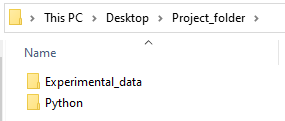
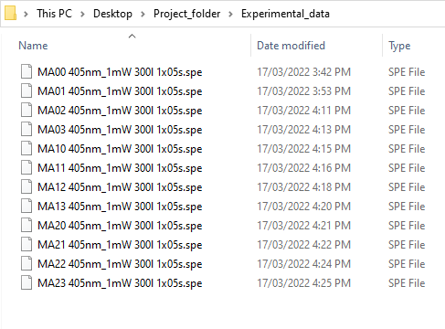
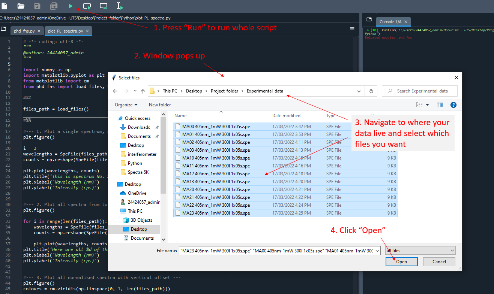
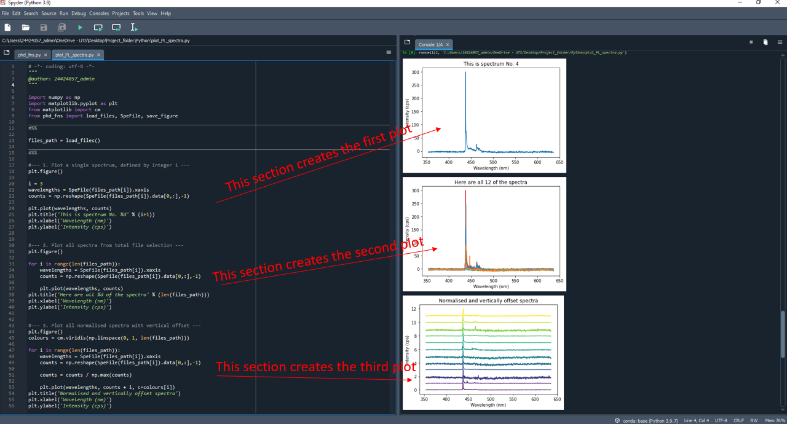
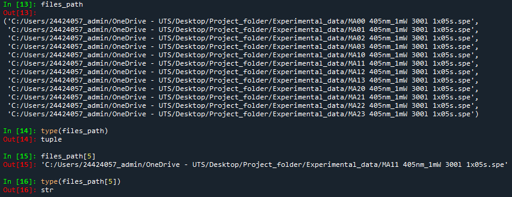

Data Processing with Python
===========================

Overview
--------

Python is a popular, free programming language that can be used to process and analyse experimental data, and is even capable of automating experimental procedures. 
Many group members find the Spyder interface is an easy way to use Python -- `the version offered by Anaconda <https://anaconda.org/anaconda/spyder>`_ 
comes prepackaged with many of the most widely used libraries like ``numpy``, ``matplotlib``, and ``scipy``.

This page will walk through some examples of the Python functions defined in the ``phd_fns.py`` library.
For a crash-course introduction, the video below goes into some detail about how to import data, plot it, and fit it with predefined functions.

.. raw:: html

    

        <iframe src="https://www.youtube.com/embed/vvoZlA9W7AQ" frameborder="0" allowfullscreen style="position: absolute; top: 0; left: 0; width: 100%; height: 100%;"></iframe>
    

Loading Data
------------

To get our experimental data, which may be saved as a ``.txt`` file or a ``.spe`` file or whatever, into Python, we can use the ``load_files`` function from the ``phd_fns.py`` library.

.. autofunction:: ~/phd_fns.load_files

Running this function in a script makes a box pop up, from which we can navigate to and select the data files we want to import. 
The ``load_files`` function returns a list, with length equal to the number of files selected, where each entry in the list is the pathway to the file on our computer.
We can then use other functions like ``np.genfromtxt`` to actually open up the file and convert it to an array object in the Python workspace.

To begin, we can make sure our project folder is well organised. It is handy to have a folder containing experimental data, and another folder containing Python script.
Most importantly, the script that does the data processing (``plot_PL_spectra.py`` in the example below) should be in the same folder as the ``phd_fns.py`` library.

Project folder:

|project-folder|

Python folder inside project folder:

|python-folder2|

.. |python-folder2| image:: ../_static/Load_and_plot_demo/python-folder2.png
   :width: 50%

Experimental data folder inside project folder:

|experimental-folder1|

In Spyder, we can write a script that uses ``load_files`` to, for example, plot PL spectra. When running the script, a prompt appears to allow file selection:

|spyder-run1|

If everything works out, we should see that the files have been successfuly opened and processed by Python:

|spyder-plot1|

Note that the ``files_path`` variable is a kind of list, while the elements of ``files_path`` are actually strings:

|files_path-types|

