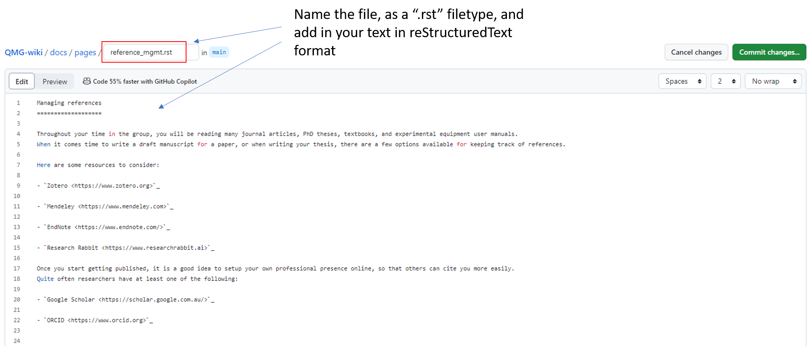

How to add a new page
=====================

The first step is to consider whether your file should be an addition to 
an existing SOP, or should be the start of a new SOP tree. Let's explore the difference.

===========================
Adding to an existing file
===========================
- Open that file, make changes, commit those changes, and push it to the main branch.

**Step 1**

|add-to-existing-1|

**Step 2**

|add-to-existing-2|

**Step 3**

|add-to-existing-3|

**Step 4**

|add-to-existing-4|

.. |add-to-existing-4| image:: ../_static/add-to-existing/add-to-existing-4.png
    :width: 60% 

**Step 5**

|add-to-existing-5|

**Step 6**

|add-to-existing-6|

.. |add-to-existing-6| image:: ../_static/add-to-existing/add-to-existing-6.png
    :width: 60% 

========================
Creating a new SOP file
========================
- Prepare your document offline as much as possible before adding it to the wiki. Once ready, follow these steps:

**Step 1**

|add-to-new-1|

**Step 2**

|add-to-new-2|

**Step 3**

|add-to-new-3|

**Step 4**

|add-to-new-4|

**Step 5**

|add-to-new-5|

**Step 6**

|add-to-new-6|

Always! Check your changes have rendered the way you expect on the QMG-wiki readthedocs_.

.. _readthedocs: http://qmg-wiki.rtfd.io/

Note: Images should be stored in "/docs/_static/". Either directly or for multiple pictures in a folder.

To reference these pictures in your SOP use: 

.. code-block:: rst
    
    Below is an image of a pixel cat.
    
    |pixelcat|

    .. |pixelcat| image:: ../_static/pixelcat.png
        :width: 45% 

Below is an image of a pixel cat.

|pixelcat|

.. |pixelcat| image:: ../_static/pixelcat.png
    :width: 45% 
