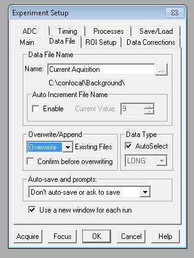
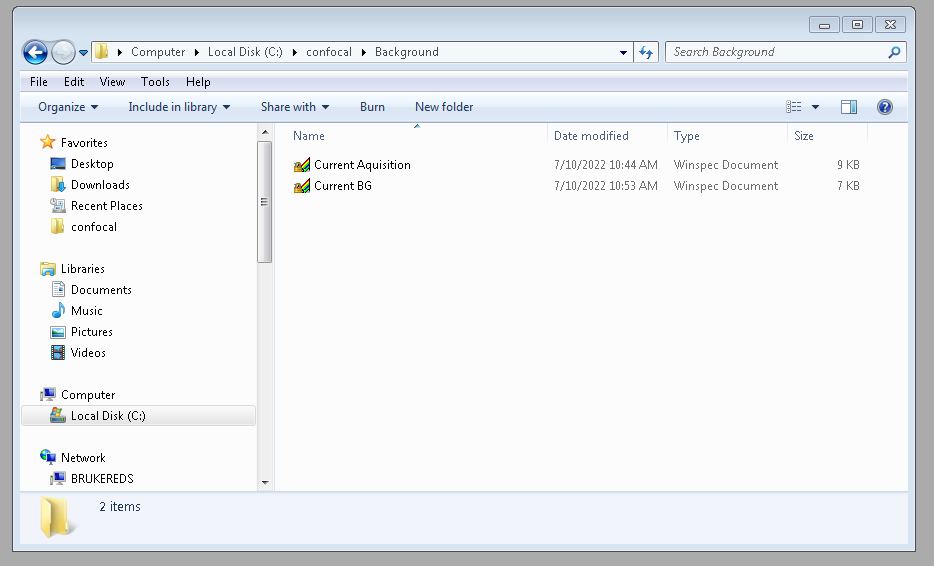
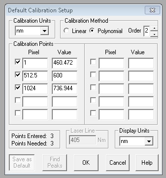
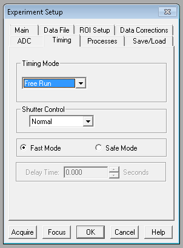

Photoluminescence Methods
==========================

Princeton Spectrometer SpecWin Settings
----------------------------------------

**INCOMPLETE 07/10/22**

Background Correction
```````````````````````

In order to take background correctly, the following settings must be in place under *Experiment Setup*

First: Ensure the "Data File Name" is saved as "Current Aquisition" in the directory "C:\\confocal\\Background".
Note: As by default "Overwrite" is selected, if you change the above filename/dir you run the risk of someone else saving over your data.

Second: Ensure the correct background correction file is chosen in the "Data Corrections" tab, as seen below. 

|DataFile| |DataCorrections|
|Folder|



.. |DataCorrections| image:: ../_static/Princeton_SOP/DataCorrection.PNG
   :width: 45%




Wavelength Calibration
```````````````````````

For a quick reference see the below calibration values. 

For a full spectrometer calibration use a discharge lamp (He or Hg etc.)
|Calibration|



Other Princeton Settings
`````````````````````````

|Main| |ROI|
|Processes| |Timing|

.. |Main| image:: ../_static/Princeton_SOP/Main.PNG
   :width: 45%

.. |Processes| image:: ../_static/Princeton_SOP/Processes.PNG
   :width: 45%

.. |ROI| image:: ../_static/Princeton_SOP/ROI.PNG
   :width: 45%




ScanSoft
-----------------------------
Uberlab.llb is the labview library that contains all the scripts (labview .vi files) that are used to create PL maps.

This library primary job is to interface with a National Instruments Data Aquisition board (NI DAQ). The DAQ controls the position of a piezo stage or a angle of scanning mirror using a DC output, and receives a signal from APDs in the form of a stream of pulses which is recoreded as a countrate.


Andor Spectrometer 
-----------------------------

**INCOMPLETE 26/10/22**

AttoDry Sample Exchange
-----------------------------

**INCOMPLETE 26/10/22**


